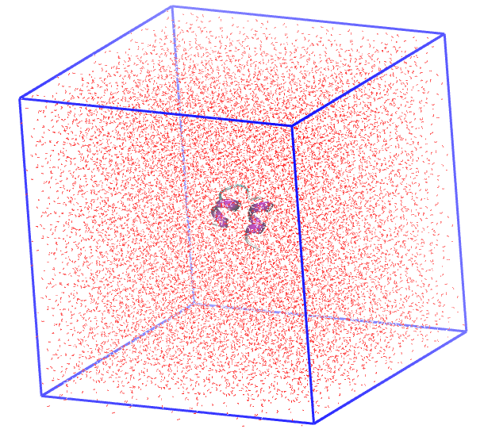

<h1 align="center">Dinâmica Molecular da Insulina Humana (PDB: 3I40) em água</h1>

<div align="center">
  <strong>🚀 Objetivo 📚</strong>
</div>

<div align="center">
  <p>Simular a insulina humana em uma caixa cúbica de água com temperatura de 298 K e 1 bar de pressão. A insulina é um hormônio regulador do metabolismo de glicose nas células humanas.</p>
  <p>Explore, colabore e divirta-se! 😄</p>
</div>

## 📖 Índice

- [Arquivos iniciais](#arquivos-iniciais)
- [Preparo da topologia da molécula: campos de forças](#preparo-da-topologia-da-molécula-campos-de-forças)
- [Definindo a caixa de simulação: dimensões, solvatação e neutralização](#definindo-a-caixa-de-simulação-dimensões-solvatação-e-neutralização)
- [Minimização do sistema](#minimização-do-sistema)
- [Equilíbrio NVT e NPT: termostatos e barostatos](#equilíbrio-nvt-e-npt-termostatos-e-barostatos)
- [Produção: integradores](#produção-integradores)

## Arquivos iniciais

Inicialmente precisamos obter as coordenadas da nossa biomolécula, campos de forças e arquivos inputs para a dinâmica. Essa etapa faz parte do planejamento do projeto.

Vamos trabalhar com a biomolécula [insulina](https://doi.org/10.1107/S1744309110000461) que possui o código [3I40](https://www.rcsb.org/structure/3I40) no PDB, com resolução de 1,85 Â. Procure sempre utilizar estruturas com **resolução < 2,5 Â**, pois assim teremos uma geometria confiavél da estrutura da biomolécula para a dinâmica (quanto menor for a resolução, mais detalhada é a estrutura). O PDB é um banco com várias biomoléculas depositadas e identificadas por códigos. Explore mais informações do PDB e da molécula de insulina humana.

<div align="center">

</div>

>Proteína PDB 3I40, insulina humana. O VMD possui o seguinte esquema de cores para a estrutura secundária: 🟣 violeta para alfa-hélices; 🟡 amarelo para beta-folhas; 🔵 ciano para voltas e ⚪ branco para superhélices ou cordas.

>[!TIP]
> Organize o diretório de trabalho criando as pastas `analysis` para os arquivos de analises e `inputs` para os arquivos .mdp da dinâmica molecular.
>

```
├── 3i40.pdb
├── amber14sb_parmbsc1_cufix.ff
│   ├── aminoacids.arn
│   ├── aminoacids.c.tdb
│   ├── aminoacids.hdb
│   ├── aminoacids.n.tdb
│   ├── aminoacids.r2b
│   ├── aminoacids.rtp
│   ├── aminoacids.vsd
│   ├── atomtypes.atp
│   ├── ca-sol7.itp
│   ├── ca-sol7.pdb
│   ├── cufix.itp
│   ├── dna.arn
│   ├── dna.hdb
│   ├── dna.r2b
│   ├── dna.rtp
│   ├── ffbonded.itp
│   ├── ffnonbonded.itp
│   ├── ffnonbonded.itp~
│   ├── forcefield.doc
│   ├── forcefield.itp
│   ├── forcefield.itp~
│   ├── gbsa.itp
│   ├── ions.itp
│   ├── Makefile.am
│   ├── Makefile.in
│   ├── mg-sol6.itp
│   ├── mg-sol6.pdb
│   ├── README.md
│   ├── rna.arn
│   ├── rna.hdb
│   ├── rna.r2b
│   ├── rna.rtp
│   ├── spce.itp
│   ├── spc.itp
│   ├── tip3p.itp
│   ├── tip4pew.itp
│   ├── tip4p.itp
│   ├── tip5p.itp
│   ├── urea.itp
│   └── watermodels.dat
├── analysis
└── inputs
    ├── ions.mdp
    ├── md.mdp
    ├── minim.mdp
    ├── npt.mdp
    └── nvt.mdp
```

## Preparo da topologia da molécula: campos de forças

O arquivo `3i40.pdb` contém as coordenadas da biomolécula com moléculas de água e ligantes. Será necessário remover as moléculas de água (`HOH`) e outros ligantes (`HETATM`) para evitar erros. Isso pode ser feito manualmente direto no arquivo ou pelo prompt de comando:

```
grep -v HETATM 3i40.pdb > 3i40_clean.pdb

# ou grep -v HOH 3i40.pdb > 3i40_clean.pdb
```

Também é necessário observar que algumas biomoléculas possuem várias cadeias identificadas como `chain A`, `chain B` etc. Recomenda-se remover manualmente as cadeias que não serão estudadas e, nesse caso, removi a cadeia B com um editor simples de texto.

Agora, vamos escolher o campo de força e o modelo de água:

```
gmx pdb2gmx -v -f 3i40_clean.pdb -o insulina.gro

# -v = verbose, para visualizar o processo.
# -f = file input, arquivo de coordenadas de entrada.
# -o = file output, arquivo de coordenadas de saída.
```
Quando solicitado, digite o número correspondente ao campo de força e o modelo de água. Digite 1 para escolher AMBER03 (ou equivalente AMBER) e 1 para escolher o modelo de água TIP3P recomendado para campo de força AMBER.

O Gromacs assumirá valores canônicos para cada aminoácidos, levando em consideração valores de pH próximos da neutralidade e adicionando hidrogênios. A carga líquida global é conservada e pode ser visualizada no display como `Total charge in system -2.000 e`.

Caso queira utilizar um campo de força externo, a pasta do campo de força com os arquivos deverá estar dentro da pasta de trabalho nomeada como `<name>.ff`.

Para visualizar no VMD, utilize:
```
vmd insulina.gro
```

>[!NOTE]
>Saiba mais sobre o comando [gmx2pdb](https://manual.gromacs.org/documentation/current/onlinehelp/gmx-pdb2gmx.html).
>
>Será gerado os seguintes arquivos:
> - insulina.gro = arquivo com as coordenadas de cada átomo da biomolécula compatível com o campo de força.
> - topol.top = arquivo com a topologia da biomolécula, ou seja, com os parâmetros necessários para os cálculos das forças.
> - posre.itp = arquivo de topologia auxiliar indicando os átomos com restrições por padrão.
>

Campo de Força  |  Informações  |  Modelo de água  |  cut-off
------- | ---------- | -------- | -------- 
**OPLS**    | O campo de força OPLS-AA (Optimized Potentials for Liquid Simulations – All Atom) é amplamente usado para simulações de proteínas, pequenas moléculas, solventes, lipídios, dentre outros. | TIP4P recomendado, mas pode usar TIP3P. Não recomendado SPC. | 1.0~1.2 nm
**AMBER**   | A família de campos de força AMBER (como amber99sb, amber99sb-ildn, amber14, etc.) é amplamente usada para proteínas, DNA/RNA e simulações biomoleculares. | TIP3P, não recomendado TIP4P e SPC. | 1.0~1.2 nm
**CHARMM**  | O campo de força CHARMM (como charmm36-jul2022.ff) é extremamente detalhado, especialmente para lipídios, proteínas e açúcares, e foi parametrizado com switching functions, o que o diferencia das abordagens anteriores. | TIP3P modificado, não substituir por TIP3P comum. | 1.2 nm
**GROMOS**  | O campo de força GROMOS96 (como gromos54a7.ff) é uma escolha clássica para simulações de proteínas, sistemas aquosos e alguns tipos de estudos de bioenergia. Ele é o único desta lista a usar potencial truncado sem PME. | SPC | 1.4 nm

| Modelo | Tipo | Descrição |
|--------|---------|--------------------------------|
| **SPC** | 3 pontos | Modelo rígido, ângulo fixo de 109.47°, parametrizado para propriedades macroscópicas. |
| **SPC/E** | 3 pontos | Versão estendida do SPC, com correção de energia de polarização. Melhor densidade e constante dielétrica. |
| **TIP3P** | 3 pontos | Muito usado com AMBER e CHARMM. Simples e compatível com muitos campos de força. |
| **TIP4P** | 4 pontos | Inclui ponto virtual (M-site) para carga negativa fora do oxigênio, melhorando propriedades de fase. |
| **TIP5P** | 5 pontos | Dois pontos extra para os pares de elétrons do oxigênio. Mais preciso para estrutura tetraédrica, porém mais custoso. |

>[!IMPORTANT]
>A escolha do campo de força e do modelo de água deve considerar a natureza do sistema e as propriedades que se deseja investigar.
>

## Definindo a caixa de simulação: dimensões, solvatação e neutralização

Nesse momento, vamos editar uma caixa para a simulação, sua borda e outros parâmetros.

```
gmx editconf -f insulina.gro -o box.gro -c -d 2.5 -bt cubic

# -f = file input, arquivo de coordenadas de entrada.
# -o = file output, arquivo de coordenadas de saída.
# -c = center, para centralizar todo o sistema.
# -d = distância entre as moléculas e a borda.
# -bt = box type, formado da caixa.
```
O formado da caixa pode ser `cubic`, `triclinic`, `octahedron` e `dodecahedron`. A escolha para o formado da caixa de simulação é a critério do pesquisador, levando em consideração o formato da biomolécula visando diminuir a quantidade de moléculas no sistema e consequentemente poupando recursos computacionais (tempo vs. energia).

As dimensões da caixa escolhida pode ser verificada no display de saida. Valores entre `1.0~2.5` nm para a distância da borda são ideais.

>[!NOTE]
>Saiba mais sobre o comando [editconf](https://manual.gromacs.org/documentation/current/onlinehelp/gmx-editconf.html).
>Esse comando é muito util inclusive para converter arquivos .pdb <-> .gro usando `gmx editconf -f <file>.gro -o <file>.pdb`.
>

>[!IMPORTANT]
>O comando `-box` pode ser usado para definir as dimensões da minha caixa. Exemplo: `gmx editconf -f insulina.gro -o box.gro -c -d 2.5 -bt cubic -box 10 10 10`, teremos uma caixa cubica com arestas máximas de 10 nm para cada orientação, sendo que a distância definida da borda de 2.5 nm será contabilizada, portanto teremos de espaço util 7.5 nm.
>
>**E quando não definimos `-box`?** Nesse caso, o algoritmo do Gromacs irá definir a caixa com base no tamanho maximo da biomolécula somado a distância da borda, medida suficiente para uma boa dinâmica com segurança e uso equilibrado de recursos computacionais.
>

<div align="center">

</div>

>Proteína PDB 3I40, insulina humana em uma caixa de simulação cubica 7.8 x 7.8 x 7.8 nm.

***Solvatação***: Agora vamos preencher nossa caixa com moléculas de água, uma vez que nossa intenção é estudar a solvatação da insulina em água.

```
gmx solvate -cp box.gro -cs spc216.gro -o solv.gro -p topol.top

# -cp = coordenates protein, coordenadas do nosso soluto (geralmente, proteina).
# -cs = coordenates solvent, coordenadas da molecula que será usada como solvente.
# -o = output file, arquivo de saida.
# -p = processing, para processar o arquivo de topologia do sistema.
```
Aqui, o software irá preencher toda a caixa de simulação com moléculas de água de origem do arquivo `spc216.gro` do próprio Gromacs, ideal para modelo TIP3P. O nome do resíduo será `SOL`. No display de saida, podemos observar a quantidade de molécula adicionadas em `Number of solvent molecules` que será adicionado ao arquivo de topologia.

>[!NOTE]
>Saiba mais sobre o comando [solvate](https://manual.gromacs.org/documentation/current/onlinehelp/gmx-solvate.html).
>Adicionalmente, podemos definir **-box** para definir as dimensões de uma nova caixa de simulação e **-maxsol** para definir a quantidade máxima de moleculas adicionadas, sendo util para calculos de concentrações.
>

>[!IMPORTANT]
>Para modelos de água TIP4P, `-cs` utilize `tip4p.gro`.
>

<div align="center">

</div>

>Proteína PDB 3I40 solvatada com água modelo TIP3P

***Neutralização***: Nessa ultima etapa de preparo da caixa de simulação, vamos neutralizar a caixa com ions. Isso é necessário pois os integradores são eficientes em sistemas neutros. A insulina possui carga -2.000 e, conforme visto anteriomente no preparo da topologia, portanto serão adicionados cátions para neutralizar o sistema.

Antes de neutralizar com o comando `genion`, é necessário gerar um arquivo binário .tpr com todas as informações necessárias para o processamento:

```
gmx grompp -v -f inputs/ions.mdp -c solv.gro -o ions.tpr -p topol.top

# -v = verbose, mostra todos os detalhes.
# -f = file input, arquivo de entrada.
# -c = coordenates, arquivo com as coordenadas.
# -o = file output, arquivo de saida.
# -p = processing, para processar o arquivo de topologia do sistema.
```

Na tag -f temos o arquivo [ions.mdp](inputs-easy/ions.mdp) dentro da pasta `inputs`. Esse arquivo possui todos os parâmetros necessários para o processamento dessa etapa. Recomenda-se um [estudo intensivo](https://manual.gromacs.org/current/user-guide/mdp-options.html) sobre os parâmetros desse arquivo.

>[!NOTE]
>Saiba mais sobre o comando [grompp](https://manual.gromacs.org/documentation/current/onlinehelp/gmx-grompp.html).
>
>Em algumas oportunidades, o Gromacs gera alguns `warnings` que devem ser verificados e, se necessário, ignorados com **-maxwarn [x]**, onde `x` é a quantidade de `warnings` a ser ignorados.
>

Agora, podemos neutralizar a caixa de simulação:

```
gmx genion -s ions.tpr -o solv_ions.gro -p topol.top -pname NA -nname CL -neutral -conc 0.15

# -s = submit binary, arquivo binário gerado com todas informações.
# -o = file output, arquivo de saida.
# -p = processing, para processar o arquivo de topologia do sistema.
# -pname = nome do cátion(+), nesse caso NA Sódio.
# -nname = nome do ânion(-), nesse caso CL Cloro.
# -neutral = para neutralizar completamente o sistema, as vezes desnecessário.
# -conc 0.15 = concentration, define a concentração em mol/L.
```
Por padrão, o Gromacs sempre irá adicionar NA e CL suficientes apenas para neutralizar a proteina (nesse caso, como a carga é -2.000 e, então adicionará 2 NA). Com as opções `-conc 0.15` e opcionalmente `-neutral`, garantimos a adição de uma solução fisiológica 0.9% m/m a fim de estabelecer um meio próximo ao real no sistema biológico humano e neutralizar a proteina. Note no display de saida a informação 'Will try to add 45 NA ions and 43 CL ions'.

O `genion` solicitara para selecionar qual o grupo de moléculas que será substituidas pela adição dos ions. Por convenção, utilizamos o grupo **SOL**. Selecione o número correspondente ao SOL.

>[!NOTE]
>Saiba mais sobre o comando [genion](https://manual.gromacs.org/documentation/current/onlinehelp/gmx-genion.html).
>

<div align="center">

</div>

>Proteína PDB 3I40 solvatada e neutralizada. Em 🔵 NA e 🟢 CL.

Pronto, agora nossa caixa de simulação está pronta!

## Minimização do sistema

Nesse momento, vamos minimizar a energia potencial do sistema tratando as sobreposições das moléculas. Novamente, vamos gerar o binário .tpr e posteriormente minimizar o sistema.

```
gmx grompp -v -f inputs/minim.mdp -c solv_ions.gro -o em.tpr -p topol.top
```
```
gmx mdrun -v -deffnm em

# -v = verbose, mostra no display de saida os detalhes.
# -deffnm = define o nome padrão para todos os arquivos de entrada e saida.
```
O comando `mdrun` é o cerne da dinâmica molecular no Gromacs. Geralmente, simplificamos os nomes dos arquivos de entradas e saidas com `-deffnm`. O nome utilizado no `grompp -o` deverá corresponder ao mesmo definido em `-deffnm`. Utilizamos o arquivo [minim.mdp](inputs-easy/minim.mdp) com as opções para a minimização.

>[!NOTE]
>Saiba mais sobre o comando [mdrun](https://manual.gromacs.org/documentation/current/onlinehelp/gmx-mdrun.html).
>

Para o acompanhamento eficiente dessa etapa, vamos verificar o gráfico de energia potencial. Vamos ler o arquivo .edr que contém as energias calculadas e gerar um arquivo .xvg.

```
gmx energy -f em.edr -s em.tpr -o potential.xvg

# -f = file input, arquivo de entrada.
# -o = file output, arquivo de saida.
# -s = submit binary, arquivo binário gerado com todas informações.
```

Verifique na tabela o número correspondente a 'Potential' e digite-o, seguindo por um espaço e pelo número 0 (zero). Exemplo: 10 0

>[!NOTE]
>Saiba mais sobre o comando [energy](https://manual.gromacs.org/documentation/current/onlinehelp/gmx-energy.html).
>

Utilizaremos o `XMGrace` para visualizar o gráfico:

```
xmgrace potential.xvg
```

Note a curva realizada, indicando a minimização do sistema.

<div align="center">

</div>

## Equilíbrio NVT e NPT: termostatos e barostatos

Vamos agora ajustar a temperatura e a pressão do nosso sistema em 298.15 K (25 ºC) e 1 bar (0,98 atm).

***NVT***: mantendo o mesmo número de moléculas (N), volume (V) e temperatura (T), vamos gerar o binario .tpr com o arquivo [nvt.mdp](inputs-easy/nvt.mdp). Nesse arquivo `nvt.mdp` definimos alguns parâmetros:

* Definimos a restrição da proteina, `define = -DPOSRES`.
* Definimos o tempo para o ajuste da temperatura, `nsteps = 50000` x 0,002 (dt) = 100 ps.
* Definimos o algoritmo para o ajuste da temperatura, `tcoupl = V-rescale`.
* Definimos os grupos para o ajuste da temperatura, `tc-grps = Protein   Non-Protein`.
* Definimos a constante de tempo de ajuste da temperatura, `tau-t = 1.0`.
* Definimos a temperatura de referência, `ref-t = 298.15`.

Como visto, muitos parâmetros são definidos nesse momento. Algumas observações para cada parâmetro:

* A restrinção de posição dos átomos não-hidrigênio da proteina nas próximas etapas é necessário para preservar a posição da proteina e adequar todo o solvente ao redor. Se a molécula exceder o limite imposto no arquivo `posre.itp` (padrão 1000 kJ/mol/nm), será permitido o movimento apenas dessa molécula.
* É mais eficiente e garente acurácia aplicar o termostato em grupos separados, no caso de `tc-grps = Protein   Non-Protein`.
* A constante de tempo de ajuste da temperatura, `tau-t = 1.0`, garante a aplicação do termostato nesse intervalo de tempo em ps. Pode variar entre `0.5~1.0`, sempre menor que a constante de ajuste do barostato e para valores muito pequenos o sistema ⚠️ 'explodirá'!

```
gmx grompp -v -f inputs/nvt.mdp -c em.gro -r em.gro -o nvt.tpr -p topol.top

# -r = restraint file, arquivo de coordenadas com as restrinções iniciais (geralmente mesmo arquivo).
```
```
gmx mdrun -f -deffnm nvt
```

>[!NOTE]
>Note a performance no display de saída, pode ser útil para planejar o tempo da simulação baseado no seu computador. Exemplo: 210.65 ns/day ou 0.114 hour/ns.
>

Vamos gerar e verificar a temperatura do sistema:

```
gmx energy -f nvt.edr -s nvt.tpr -o temperature.xvg
```

Selecione o número correspondente a 'Temperature' seguida por espaço e 0 (zero).

```
xmgrace temperature.xvg
```

<div align="center">

</div>

Após 20 ps a temperatura do sistema estabilizou em 298.15 K. Caso não houver a estabilização, o tempo em `nsteps` deve ser aumentado e a etapa repetida. Agora partimos para o ajuste de pressão.

***NPT***: mantendo o mesmo número de moléculas (N), pressão (P) e temperatura (T), vamos gerar o binario .tpr com o arquivo [npt.mdp](inputs-easy/npt.mdp). Nesse arquivo `npt.mdp` definimos:

* O algoritmo responsável por ajustar a pressão, `pcoul = C-rescale`.
* A constante de tempo de ajuste da pressão, `tau-p = 3.0`.
* A pressão requerida, `ref-p = 1.0`.

Os demais parâmetros são idênticos ou semelhantes a etapa NVT, entretanto o tempo de equilibrio é um pouco maior na etapa NPT. Vamos gerar o arquivo binário .tpr a partir das coordenadas anteriores da etapa NVT.

```
gmx grompp -v -f inputs/npt.mdp -c nvt.gro -r nvt.gro -t nvt.cpt -o npt.tpr -p topol.top

# -t = time file, arquivo com os checkpoint anterior (geralmente utilizado para indicar o ponto de partida)
```
```
gmx mdrun -v -deffnm npt
```

<div align="center">

</div>
<div align="center">

</div>

Pelo gráfico da pressão, notamos picos distintos que não são representativos e adequados para avaliar o desempenho do barostato. O gráfico de densidade é ideal para avaliar, onde notamos uma estabilização da densidade com pouca variação.

Vamos para um breve resumo dos termostatos e barostatos.

| Termostato | Características | Vantagens | Limitações
|--------|---------|-------------|---------------|
| **Berendsen** | Rápido para equilibrar temperatura | Simples e eficiente para equilíbrios | Não reproduz corretamente as flutuações canônicas |
| **V-rescale** | Mantém temperatura média correta e flutuações realistas | Estável e mais preciso que Berendsen | Ligeiramente mais complexo |
| **Nose-Hoover** | Mantém distribuição canônica (NVT) | Correto estatisticamente | Pode ter acoplamento mais lento |

| Barostato | Características | Vantagens | Limitações
|--------|---------|-------------|---------------|
| **Berendsen** | Ajusta pressão rapidamente durante o equilíbrio | Simples, ideal para pré-produção | Não reproduz corretamente as flutuações canônicas |
| **Parrinello-Rahman** | Permite flutuações de volume e forma da caixa (NPT) | Correto para simulações de produção | Pode ser instável sem bom equilíbrio inicial |
| **C-rescale** | Versão estocástica rigorosa de controle de pressão. Mantém flutuações canônicas corretas no ensemble NPT | Produz NPT canônico exato, mais robusto e estável que Parrinello-Rahman em algumas situações | Disponível a partir do GROMACS 2023, não tão testado quanto Parrinello-Rahman |

>[!IMPORTANT]
>A escolha do termostato e barostato deve considerar a natureza do sistema e as propriedades que se deseja investigar.
>O Gromacs recomenda: V-rescale e C-rescale.
>

Agora estamos prontos para nossa simulação!

## Produção: integradores

Working...
