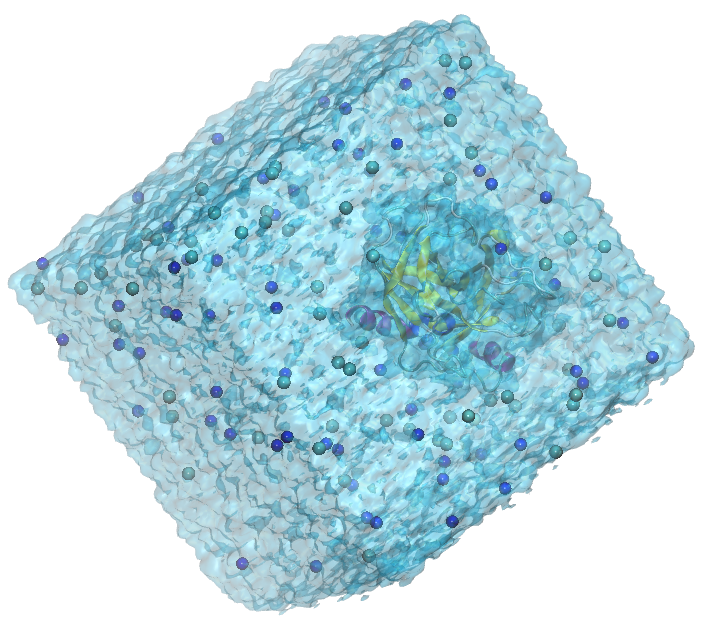
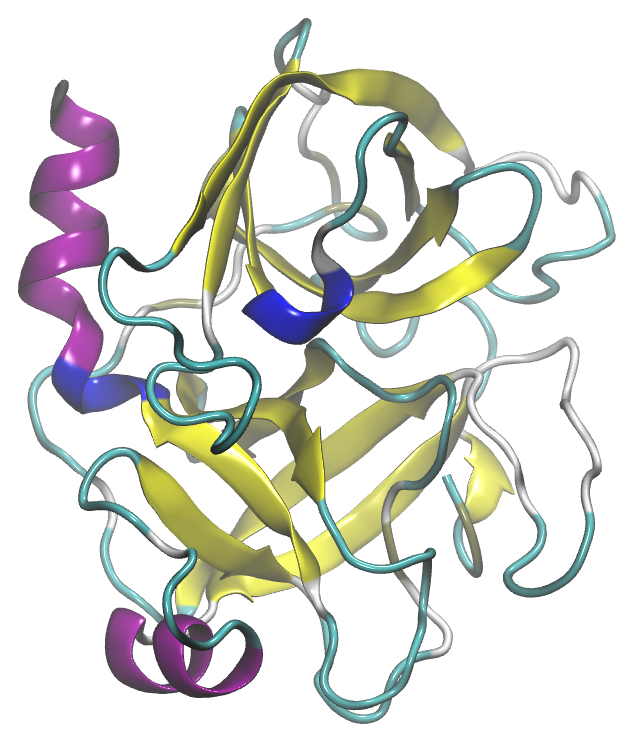
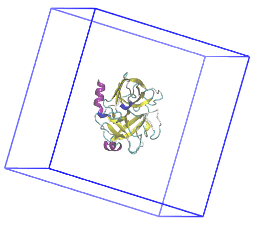
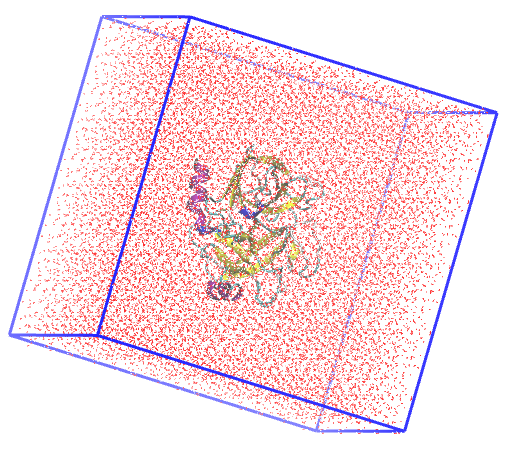
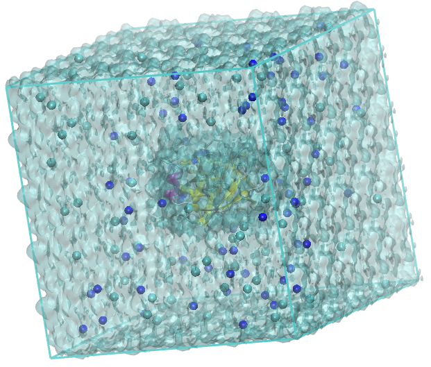
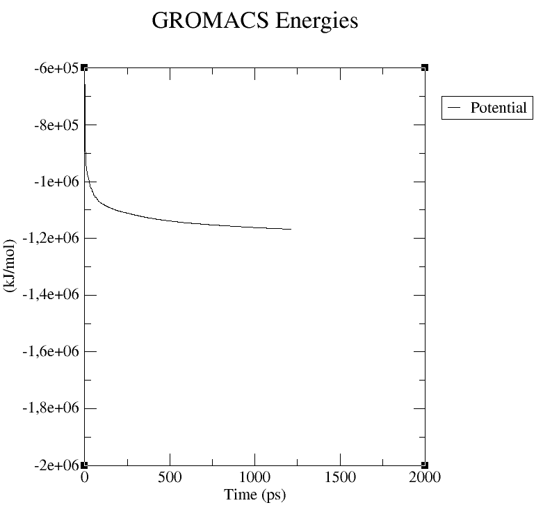
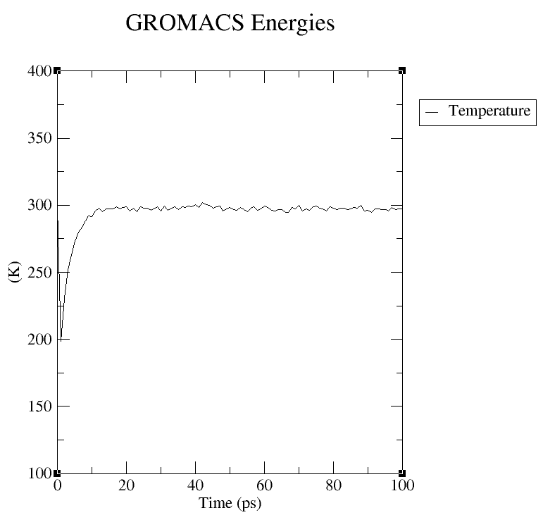
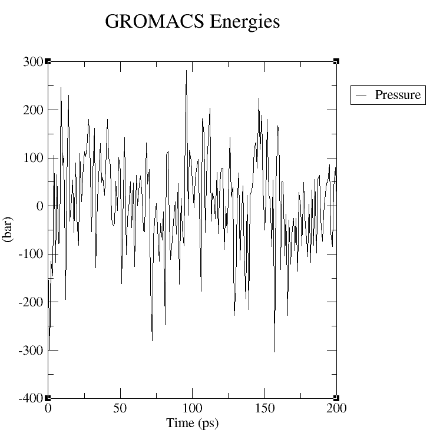
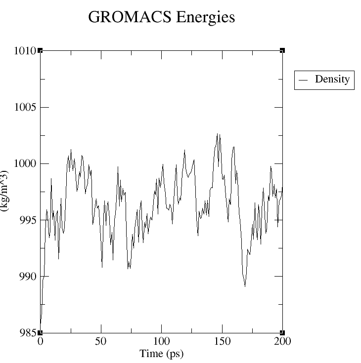

<h1 align="center">Criar imagens e videos de dinâmicas moleculares</h1>

<div align="center">
  <strong>🚀 Objetivo 📚</strong>
</div>

<div align="center">
  <p>O objetivo deste tutorial é criar imagens e video com qualidade para publicações a partir da dinâmica molecular da tripsina pancreática bovina.</p>
  <p>Explore, colabore e estude! 😄 Dúvidas: <a href="mailto:patrick.faustino@unesp.br">patrick.faustino@unesp.br</a></p>
</div>

## 📖 Índice

- [Arquivos iniciais](#arquivos-iniciais)
- [Preparo da topologia da molécula: campos de forças](#preparo-da-topologia-da-molécula-campos-de-forças)
- [Definindo a caixa de simulação: dimensões, solvatação e neutralização](#definindo-a-caixa-de-simulação-dimensões-solvatação-e-neutralização)
- [Minimização do sistema](#minimização-do-sistema)
- [Equilíbrio NVT e NPT: termostatos e barostatos](#equilíbrio-nvt-e-npt-termostatos-e-barostatos)
- [Produção: integradores](#produção-integradores)
- [Resumo](#resumo)

## Representação gráfica no VMD
O [VMD](https://www.ks.uiuc.edu/Development/Download/download.cgi?PackageName=VMD) permite visualizar moléculas e realizar análises. Para instalação, verifique este repositório.

>[!NOTE]
>Após a finalização da etapa de produção, é necessário o tratamento do arquivo de trajetórias `.xtc` ou `.trr`.
>

Para carregar o arquivo de coordenadas no VMD:
```
vmd md_5ns.gro
```

No menu do VMD, podemos realizar algumas melhorias na visualização:
```
Display > Orthographic    # para alterar a visão referencial
Display > Axes > Off    # para remover o eixo axial do painel de visualização
Display > Rendermode > GLSL    # para alterar o motor de renderização
Graphics > Colors > Display > Background > 8 white    # altera a cor do plano de fundo
```

Para modificar a forma de representação das moléculas:
```
Graphics > Representations
```

Na janela que abrir, vamos criar representações para `protein`, `water`, `resname NA` e `resname CL` utilizando o botão **Create Rep**, e realizar as sequintes configurações:
```
Selected Atoms: protein; Coloring Method: Secundary Structure; Drawing Method: NewCartoon; Material: EdgyShiny
Selected Atoms: water; Coloring Method: ColorId - 22 cyan3; Drawing Method: QuickSurf; Material: Transparent
Selected Atoms: resname NA; Coloring Method: Name; Drawing Method: VDW; Material: EdgyShiny
Selected Atoms: resname CL; Coloring Method: Name; Drawing Method: VDW; Material: EdgyShiny
```

<div align="center">

</div>

>PDB 1S0Q, Tripsina Pancreática Bovina. O VMD (*Visual Molecular Dynamics*) possui esquema de cores para estruturas de biomoléculas: 🟣 violeta para alfa-hélices; 🟡 amarelo para beta-folhas; 🔵 azul para Hélices 3-10; 🔵 ciano para voltas e ⚪ branco para novelos ou cordas.

>[!TIP]
>Na janela Graphics > Representations... é possivel desativar ou ativar a visualização da representação da molécula com um clique duplo sob a molécula desejada.
>


Para iniciar a simulação, obtenha os arquivos de topologia (campos de força), as coordenadas iniciais da biomolécula e os parâmetros de entrada para a dinâmica molecular.

Utilize a estrutura da 1S0Q com o código [1S0Q](https://www.rcsb.org/structure/1S0Q) do PDB, que possui uma resolução de 1,02 Å. **Dê preferência a estruturas com resolução cristalográfica inferior a 2,5 Å**, pois isso garante uma geometria molecular mais confiável e detalhada, o que é fundamental para a qualidade da simulação. Uma resolução menor proporciona maior detalhamento cristalográfico.

Acesse a página da estrutura no [PDB (*Protein Data Bank*)](https://www.rcsb.org/) para uma análise aprofundada. Para garantir maior precisão e realismo, explore os detalhes complementares da estrutura. Verifique o método experimental usado para sua obtenção, a presença de ligantes, possíveis modificações estruturais e os estados de protonação dos resíduos.

<div align="center">

</div>

>PDB 1S0Q, Tripsina Pancreática Bovina. O VMD (*Visual Molecular Dynamics*) possui esquema de cores para estruturas de biomoléculas: 🟣 violeta para alfa-hélices; 🟡 amarelo para beta-folhas; 🔵 azul para Hélices 3-10; 🔵 ciano para voltas e ⚪ branco para novelos ou cordas.

>[!TIP]
>Organize seu diretório de trabalho. Crie duas subpastas: `analysis`, destinada aos resultados das análises, e `inputs`, para armazenar os arquivos de parâmetros da dinâmica molecular (.mdp).
>

```
├── 1S0Q.pdb
├── amber14sb_parmbsc1_cufix.ff
├── analysis
└── inputs
    ├── ions.mdp
    ├── md.mdp
    ├── minim.mdp
    ├── npt.mdp
    └── nvt.mdp
```

## Preparo da topologia da molécula: campos de forças

O arquivo **1S0Q.pdb** contém, além das coordenadas da biomolécula, moléculas de água (`HOH`) e outros ligantes (`HETATM`). Remova esses componentes extras para evitar erros nas etapas subsequentes. Realize essa limpeza de duas maneiras: editando o arquivo manualmente ou utilizando os comandos de terminal apresentados a seguir.

```
grep -v HETATM 1S0Q.pdb > 1S0Q_clean.pdb

# grep -v HOH 1S0Q.pdb > 1S0Q_clean.pdb
```

Observe que algumas biomoléculas apresenta múltiplas cadeias, identificadas como `chain A`, `chain B`, e assim por diante. Remova as cadeias desnecessárias em um editor de texto simples.

Em seguida, escolha o campo de força e o modelo de água que serão usados na simulação:

>[!NOTE]
>Caso utilize um campo de força externo, coloque a pasta correspondente no diretório de trabalho como <<name>>.ff.
>

```
gmx pdb2gmx -v -f 1S0Q_clean.pdb -o tripsina.gro

# -v = verbose, para visualizar o processo.
# -f = file input, arquivo de entrada das coordenadas.
# -o = file output, arquivo de saída das coordenadas.
```

O programa solicitará duas escolhas em sequência. Responda a cada prompt da seguinte forma:
 - Para o campo de força, digite 1 para selecionar AMBER14SB_parmbsc1.
 - Para o modelo de água, digite 1 novamente para selecionar TIP3P recommended, o padrão recomendado para a família AMBER.

O GROMACS utiliza estados de protonação canônicos para cada aminoácido (assumindo pH neutro) e adiciona os hidrogênios correspondentes. Ao final do processo, o programa conserva a carga líquida total da biomolécula. Confirme este valor no terminal, procurando pela mensagem: `Total charge in system 8.000 e`.

Para visualizar no VMD, utilize:
```
vmd tripsina.gro
```

>[!NOTE]
>Saiba mais sobre [gmx2pdb](https://manual.gromacs.org/documentation/current/onlinehelp/gmx-pdb2gmx.html).
>
>Serão criados os arquivos:
> - insulina.gro = arquivo com as posições iniciais de cada átomo da biomolécula compatível com o campo de força escolhido.
> - topol.top = arquivo com os parâmetros necessários para as integrações e derivações numéricas.
> - posre.itp = arquivo de topologia auxiliar indicando os átomos com restrições por padrão.
>

Campo de Força  |  Informações  |  Modelo de água  |  cut-off
------- | ---------- | -------- | -------- 
**OPLS**    | O campo de força OPLS-AA (Optimized Potentials for Liquid Simulations – All Atom) é amplamente usado para simulações de proteínas, pequenas moléculas, solventes, lipídios, dentre outros. | TIP4P recomendado, mas pode usar TIP3P. Não recomendado SPC. | 1.0~1.2 nm
**AMBER**   | A família de campos de força AMBER (como amber99sb, amber99sb-ildn, amber14, etc.) é amplamente usada para proteínas, DNA/RNA e simulações biomoleculares. | TIP3P, não recomendado TIP4P e SPC. | 1.0~1.2 nm
**CHARMM**  | O campo de força CHARMM (como charmm36-jul2022.ff) é extremamente detalhado, especialmente para lipídios, proteínas e açúcares, e foi parametrizado com *switching functions*, o que o diferencia das abordagens anteriores. | TIP3P modificado, não substituir por TIP3P comum. | 1.2 nm
**GROMOS**  | O campo de força GROMOS96 (como gromos54a7.ff) é uma escolha clássica para simulações de proteínas, sistemas aquosos e alguns tipos de estudos de bioenergia. Ele é o único desta lista a usar potencial truncado sem PME. | SPC | 1.4 nm

| Modelo | Tipo | Descrição |
|--------|---------|--------------------------------|
| **SPC** | 3 pontos | Modelo rígido, ângulo fixo de 109.47°, parametrizado para propriedades macroscópicas. |
| **SPC/E** | 3 pontos | Versão estendida do SPC, com correção de energia de polarização. Melhor densidade e constante dielétrica. |
| **TIP3P** | 3 pontos | Muito usado com AMBER e CHARMM. Simples e compatível com muitos campos de força. |
| **TIP4P** | 4 pontos | Inclui ponto virtual (M-site) para carga negativa fora do oxigênio, melhorando propriedades de fase. |
| **TIP5P** | 5 pontos | Dois pontos extra para os pares de elétrons do oxigênio. Mais preciso para estrutura tetraédrica, porém mais custoso. |

>[!IMPORTANT]
>Escolha o campo de força e o modelo de água com base na natureza do seu sistema e nas propriedades que você deseja investigar.
>
>É de extrema importância o conhecimento completo sobre os formatos de arquivos utilizados pelo GROMACS. Para estudos: [File formats topology](https://manual.gromacs.org/current/reference-manual/topologies/topology-file-formats.html) e [File formats](https://manual.gromacs.org/current/reference-manual/file-formats.html).
>

## Definindo a caixa de simulação: dimensões, solvatação e neutralização

Nesta etapa, defina a caixa de simulação e ajuste seus parâmetros, como as dimensões, a distância da biomolécula até as bordas e outras configurações relevantes para a correta montagem do sistema.

```
gmx editconf -f tripsina.gro -o box.gro -c -d 2.0 -bt cubic

# -c = center, para centralizar a biomolécula na caixa.
# -d = distance, distância em nm entre todas moléculas e a borda.
# -bt = box type, formato da caixa.
```

Escolha o formato da caixa de simulação (entre `cubic`, `triclinic`, `octahedron` ou `dodecahedron`) considerando a geometria da sua biomolécula. O objetivo é selecionar um formato que otimize o volume do sistema, reduzindo o número de moléculas de solvente. Essa otimização economiza recursos computacionais ao equilibrar o tempo de simulação e a demanda energética.

Verifique as dimensões da caixa na mensagem de saída do programa. Certifique-se de que a distância mínima entre a biomolécula e as bordas da caixa esteja na **faixa de 1,0 a 2,5 nm, pois esses valores são ideais para a simulação**.

>[!NOTE]
>Saiba mais sobre [editconf](https://manual.gromacs.org/documentation/current/onlinehelp/gmx-editconf.html).
>
>Essa função é util para converter arquivos .pdb <--> .gro usando `gmx editconf -f <file>.gro -o <file>.pdb`.
>

>[!IMPORTANT]
>A tag `-box` pode ser utilizada para definir as dimensões da caixa de simulação. Por exemplo, ao executar `gmx editconf -f insulina.gro -o box.gro -c -d 2.5 -bt cubic -box 10 10 10`, obtém-se uma caixa cúbica com arestas de 10 nm. Nessa configuração, a distância da borda definida como 2,5 nm será considerada, resultando em um espaço útil de 7,5 nm para a acomodação das moléculas, garantindo o afastamento adequado entre a molécula e as bordas da caixa.
>
>**E quando não definimos `-box`?** Nessa configuração, o algoritmo do GROMACS definirá as dimensões da caixa com base no tamanho máximo da biomolécula, acrescido da distância especificada para a borda. Essa abordagem proporciona uma margem suficiente para garantir uma dinâmica molecular segura, ao mesmo tempo em que promove o uso eficiente dos recursos computacionais.
>

<div align="center">

</div>

>PDB 1S0Q, tripsina em uma caixa de simulação cúbica.

Para vizualisar no VMD:

```
vmd box.gro

Extensions > Tk Console > pbc box -color blue
```

### Solvatação

Em seguida, preencha a caixa de simulação com moléculas de água para solvatar a insulina. Este procedimento garante que a biomolécula fique imersa em um ambiente aquoso, simulando as condições fisiológicas necessárias para a análise da dinâmica molecular.

```
gmx solvate -cp box.gro -cs spc216.gro -o solvated.gro -p topol.top

# -cp = coordenates protein, coordenadas do nosso soluto (geralmente, proteina).
# -cs = coordenates solvent, coordenadas da molecula que será usada como solvente.
# -p = processing, para processar o arquivo de topologia do sistema.
```

O GROMACS acaba de preencher a caixa com moléculas de água do arquivo `spc216.gro` (compatível com o modelo TIP3P), identificando-as com o resíduo **SOL**. Verifique na mensagem de saída a linha `Number of solvent molecules` para confirmar a quantidade de solvente adicionado. O programa já atualizou essa informação automaticamente na seção `[ molecules ]` do seu arquivo `topol.top`.

>[!NOTE]
>Saiba mais sobre [solvate](https://manual.gromacs.org/documentation/current/onlinehelp/gmx-solvate.html).
>
>Adicionalmente, pode ser definido **-box** para as dimensões de uma nova caixa de simulação e **-maxsol** para limitar a quantidade máxima de moleculas adicionadas, útil quando existe uma concentração calculada.
>

>[!IMPORTANT]
>Para modelos de água TIP4P, `-cs` utilize `tip4p.gro`.
>

<div align="center">

</div>

>PDB 1S0Q solvatada com água modelo TIP3P

### Neutralização
A etapa final na preparação da caixa é a neutralização do sistema com a adição de íons. Este passo é fundamental, pois os algoritmos da simulação funcionam com maior eficiência em sistemas eletricamente neutros. Como visto na etapa anterior, a carga total da insulina é de 8,000 e. Portanto, adicione dois cátions para compensar essa carga e zerar a carga total do sistema.

Antes de neutralizar com a função `genion`, é necessário gerar um arquivo binário `.tpr` com as informações necessárias para o processamento:

```
gmx grompp -v -f inputs/ions.mdp -o ions.tpr -c solvated.gro -p topol.top

# -c = coordenates, arquivo com as coordenadas do sistema.
```

Na tag -f está indicado o arquivo [ions.mdp](inputs-easy/ions.mdp) da pasta `/inputs`. Esse arquivo possui todos os parâmetros necessários para o processamento dessa etapa. Recomenda-se o [estudo intensivo](https://manual.gromacs.org/current/user-guide/mdp-options.html) sobre os parâmetros desse arquivo.

>[!NOTE]
>Saiba mais sobre [grompp](https://manual.gromacs.org/documentation/current/onlinehelp/gmx-grompp.html).
>
>Em algumas oportunidades, o GROMACS gera `warnings` que devem ser verificados e, se necessário, suprimidos com **-maxwarn [x]**, onde `x` é a quantidade de `warnings` a ser suprimidos. Novamente, revise!
>

O programa genion solicitará que você selecione um grupo de moléculas para substituir pelos íons. A convenção é sempre escolher o grupo de solvente (**SOL**). Portanto, quando solicitado, digite o número correspondente à opção SOL.

Agora, adicione os íons necessários para neutralizar a carga da caixa de simulação e garantir que o sistema seja eletricamente neutro.

```
gmx genion -s ions.tpr -o solvated_ions.gro -p topol.top -pname NA -nname CL -neutral -conc 0.15

# -s = submit binary, arquivo binário criado anteriormente com todas informações do sistema.
# -pname = nome do cátion(+), nesse caso NA Sódio.
# -nname = nome do ânion(-), nesse caso CL Cloro.
# -neutral = para neutralizar completamente o sistema, às vezes desnecessário.
# -conc 0.15 = concentration, define a concentração em mol/L.
```

Por padrão, o GROMACS adiciona íons de sódio (NA) e cloreto (CL) em quantidade suficiente apenas para neutralizar o sistema. Neste caso, considerando a carga líquida de 8,000 e serão adicionados oito íons CL ao sistema. Entretanto, ao utilizar as opções `-conc 0.15` e, opcionalmente, `-neutral`, é possível garantir a adição de uma solução fisiológica a 0,9% m/m, simulando o ambiente semelhante ao sistema biológico humano, além de assegurar a neutralidade do sistema.

Na mensagem de saída, pode-se observar a mensagem `Will try to add 67 NA ions and 75 CL ions`, indicando o número de íons adicionados para atingir a concentração e a neutralidade. O arquivo `topol.top` é atualizado com as quantidades de ions adicionadas.


>[!NOTE]
>Saiba mais sobre [genion](https://manual.gromacs.org/documentation/current/onlinehelp/gmx-genion.html).
>

<div align="center">

</div>

>PDB 1S0Q solvatada e neutralizada. Em 🔵 NA e 🟢 CL.

## Minimização do sistema

O próximo passo é a minimização de energia. Este procedimento remove sobreposições entre as moléculas e garante uma configuração estrutural estável, essencial para as etapas seguintes da simulação. Para isso, execute duas ações em sequência: primeiro, gere um novo arquivo binário `.tpr` para a minimização; depois, execute o comando de minimização de energia com o arquivo recém-criado.

```
gmx grompp -v -f inputs/minim.mdp -c solvated_ions.gro -o em.tpr -p topol.top
```
```
gmx mdrun -v -deffnm em

# -deffnm = define o nome padrão de todos arquivos de entrada e saida.
```

A função `mdrun` constitui o núcleo do processo de dinâmica molecular no GROMACS. Recomenda-se simplificar os nomes dos arquivos de entrada e saída utilizando a opção `-deffnm`. O nome utilizado em `grompp -o <name>.tpr` deve ser o mesmo especificado em `-deffnm`, garantindo consistência entre os arquivos utilizados. Para a etapa de minimização, é adotado o arquivo de parâmetros [minim.mdp](inputs-easy/minim.mdp), que contém os parâmetros para o procedimento de minimização.


>[!NOTE]
>Saiba mais sobre [mdrun](https://manual.gromacs.org/documentation/current/onlinehelp/gmx-mdrun.html).
>

Analise a energia potencial para acompanhar o sucesso desta etapa. Para fazer isso, processe o arquivo de energia (.edr) para extrair os dados em um formato gráfico (.xvg). Este procedimento é essencial para avaliar graficamente se o sistema alcançou a convergência e a estabilidade energética.

```
gmx energy -f em.edr -s em.tpr -o potential.xvg
```

Verifique na tabela o número correspondente a 'Potential' e digite-o, seguindo por um espaço e pelo número 0 (zero). Exemplo: `10 0`.

>[!NOTE]
>Saiba mais sobre [energy](https://manual.gromacs.org/documentation/current/onlinehelp/gmx-energy.html).
>

Utilize o `XMGrace` para visualizar o gráfico:

```
xmgrace potential.xvg
```

Observe a curva no gráfico, a qual indica a minimização efetiva do sistema.

<div align="center">

</div>

## Equilíbrio NVT e NPT: termostatos e barostatos

As próximas etapas são a equilibração da temperatura e da pressão do sistema. Primeiro, ajuste a temperatura para 298,15 K (25 °C) e, em seguida, a pressão para 1 bar (0,98 atm). Essas condições visam simular um ambiente termodinâmico semelhante ao meio biológico.

### NVT: ajustando a temperatura da caixa de simulação
Inicie a equilibração de temperatura (ensemble NVT), na qual o número de moléculas (N), o volume (V) e a temperatura (T) são mantidos constantes. Para esta etapa, gere o arquivo binário `.tpr` utilizando o arquivo de parâmetros [nvt.mdp](inputs-easy/nvt.mdp). Este arquivo contém as seguintes definições:

* Define a restrição da biomolécula, com `define = -DPOSRES`.
* Define o tempo para o ajuste da temperatura, em `nsteps = 50000` x 0,002 (dt) = 100 ps.
* Define o algoritmo para o ajuste da temperatura, em `tcoupl = V-rescale`.
* Define os grupos para o ajuste da temperatura, com `tc-grps = Protein   Non-Protein`.
* Define a constante de acoplamento da temperatura, com `tau-t = 1.0`.
* Define a temperatura de referência, em `ref-t = 298.15`.

Algumas considerações específicas:

* **Restrições de Posição**: Utilize restrições de posição para manter os átomos pesados da proteína (não-hidrogênios) "congelados" em suas posições iniciais. Esta técnica é crucial para permitir que as moléculas de água se acomodem e relaxem ao redor da proteína sem desestabilizar a sua estrutura. O arquivo `posre.itp` define a força máxima dessa restrição (padrão de 1000 kJ/mol/nm). Se um átomo sofrer um choque muito forte, a restrição permite que apenas ele se mova ligeiramente para aliviar a tensão, preservando a estabilidade do resto da molécula.

* **Grupos de Temperatura (Termostato)**: Separe o controle de temperatura em dois grupos com o parâmetro `tc-grps = Protein Non-Protein`. Esta abordagem aumenta a precisão e a eficiência do controle de temperatura. Ela permite que o termostato meça e ajuste a temperatura da proteína e do solvente de forma independente, corrigindo as variações térmicas de cada componente com maior acurácia.

* **Constante de Acoplamento da Temperatura (tau-t)**: Ajuste a frequência de atuação do termostato com o parâmetro `tau-t = 1.0`. Este valor, em picossegundos (ps), define a frequência com que o termostato corrige a temperatura do sistema. Mantenha tau-t na faixa de **0,5 a 1,0** ps e certifique-se de que ele seja **sempre menor que a constante de acoplamento da pressão (tau-p)**, que será definida na próxima etapa. Atenção: Evite usar valores muito baixos para tau-t. Isso faria o termostato agir de forma agressiva, o que pode causar instabilidades e levar ao colapso da simulação ("explosão").

```
gmx grompp -v -f inputs/nvt.mdp -c em.gro -r em.gro -o nvt.tpr -p topol.top

# -r = restrain file, arquivo de coordenadas com as restrinções iniciais (geralmente mesmo arquivo).
```
```
gmx mdrun -v -deffnm nvt
```

>[!NOTE]
>Verifique a performance na mensagem de saída, pode ser útil para planejar o tempo da simulação baseado no seu computador. Exemplo: 149.69 ns/day ou 0.160 hour/ns.
>

Após a equilibração, verifique se a temperatura do sistema se estabilizou corretamente. Para isso, gere e analise o gráfico de temperatura. No gráfico, confirme se a temperatura média corresponde ao valor definido nos parâmetros e observe se as flutuações estão estáveis.

```
gmx energy -f nvt.edr -s nvt.tpr -o temperature.xvg
```

Selecione o número correspondente a 'Temperature' seguida por espaço e 0 (zero).

```
xmgrace temperature.xvg
```

<div align="center">

</div>

Após 20 ps, observe que a temperatura do sistema estabilizou em 298,15 K. Caso a estabilização não seja alcançada, aumente o valor de `nsteps` e realiza novamente a etapa. Após a temperatura devidamente controlada, procede-se ao ajuste da pressão do sistema.

### NPT: ajustando a pressão da caixa de simulação
Concluída a equilibração da temperatura, inicie a equilibração da pressão (ensemble NPT). Nesta etapa, a densidade do sistema será ajustada para a pressão correta, mantendo-se constantes o número de moléculas (N), a pressão (P) e a temperatura (T). Para isso, gere um novo arquivo binário .tpr utilizando o arquivo de parâmetros [npt.mdp](inputs-easy/npt.mdp). Este arquivo contém as seguintes definições:

* O algoritmo responsável por ajustar a pressão, com `pcoul = C-rescale`.
* A constante de acoplamento da pressão, em `tau-p = 3.0`.
* A pressão de referência, em bar, `ref-p = 1.0`.

Você notará que a maioria dos parâmetros para a etapa NPT é idêntica ou semelhante à da etapa NVT anterior. A principal diferença é que o tempo de simulação para a equilibração de pressão costuma ser maior. É importante destacar que o GROMACS utiliza o estado final da equilibração NVT como o ponto de partida para esta nova etapa. Esse encadeamento garante a continuidade do processo, aplicando agora as novas condições de pressão constante.

```
gmx grompp -v -f inputs/npt.mdp -c nvt.gro -r nvt.gro -t nvt.cpt -o npt.tpr -p topol.top

# -t = time file, arquivo com checkpoint anterior (geralmente utilizado para indicar o ponto de partida com relação a dinâmica anterior)
```
```
gmx mdrun -v -deffnm npt
```
```
gmx energy -f npt.edr -s npt.tpr -o pressure.xvg
gmx energy -f npt.edr -s npt.tpr -o density.xvg
```

<div align="center">

</div>
<div align="center">

</div>

Para avaliar a equilibração da pressão, evite focar no gráfico de pressão, pois suas flutuações são geralmente muito altas e pouco informativas. Em vez disso, analise o gráfico de densidade, que é o indicador correto para esta etapa. No gráfico, verifique se a curva se estabiliza em um valor médio, apresentando apenas pequenas variações. Essa estabilização confirma que o sistema atingiu a densidade correta e está em equilíbrio.

A seguir, apresentamos um breve resumo dos principais termostatos e barostatos disponíveis para controlar a temperatura e a pressão em suas simulações.

| Termostato | Características | Vantagens | Limitações
|--------|---------|-------------|---------------|
| **Berendsen** | Rápido para equilibrar temperatura | Simples e eficiente para equilíbrios | Não reproduz corretamente as flutuações canônicas |
| **V-rescale*** | Mantém temperatura média correta e flutuações realistas | Estável e mais preciso que Berendsen | Ligeiramente mais complexo |
| **Nose-Hoover** | Mantém distribuição canônica (NVT) | Correto estatisticamente | Pode ter acoplamento mais lento |

| Barostato | Características | Vantagens | Limitações
|--------|---------|-------------|---------------|
| **Berendsen** | Ajusta pressão rapidamente durante o equilíbrio | Simples, ideal para pré-produção | Não reproduz corretamente as flutuações canônicas |
| **Parrinello-Rahman** | Permite flutuações de volume e forma da caixa (NPT) | Correto para simulações de produção | Pode ser instável sem bom equilíbrio inicial |
| **C-rescale*** | Versão estocástica rigorosa de controle de pressão. Mantém flutuações canônicas corretas no ensemble NPT | Produz NPT canônico exato, mais robusto e estável que Parrinello-Rahman em algumas situações | Disponível a partir do GROMACS 2023, pouco testado em comparação com Parrinello-Rahman |

>[!IMPORTANT]
>A escolha do termostato e barostato deve considerar a natureza do sistema e as propriedades que se deseja investigar.
>
>O GROMACS recomenda: **V-rescale** e **C-rescale**.
>

## Produção: integradores
A etapa final é a simulação de produção. Se todos os passos anteriores foram concluídos sem erros, seu sistema foi preparado corretamente e a simulação de produção tem grandes chances de ser bem-sucedida. Durante a execução, que pode ser longa, monitore a carga de trabalho (CPU/GPU) e a temperatura do seu computador, pois problemas externos de hardware ou software ainda podem interromper o processo.

Inicie a simulação de produção. Primeiro, gere o arquivo de entrada binário (.tpr) com base no arquivo de parâmetros [md.mdp](inputs-easy/md.mdp). Logo depois, inicie a simulação final de dinâmica molecular executando o comando a partir desse arquivo `.tpr`.

```
gmx grompp -v -f inputs/md.mdp -c npt.gro -t npt.cpt -o md_5ns.tpr -p topol.top
```
```
gmx mdrun -v -deffnm md_5ns
```
Pontos importantes sobre os parâmetros da simulação de produção:

- **Remoção das Restrições de Posição**: Diferentemente das etapas de equilibração, remova todas as restrições de posição da biomolécula. Agora que o sistema está equilibrado, o objetivo é permitir que a molécula se mova e se comporte livremente, sob a influência apenas das forças físicas do sistema. É nesta fase que observamos a dinâmica "natural" da biomolécula, o que caracteriza a simulação de produção.

- **Seleção do Integrador (`integrator = md`)**: A escolha do algoritmo (integrador) que calcula o movimento dos átomos é crucial. Para simulações de produção padrão, utilize o integrador `md`. Este integrador, que implementa o algoritmo Leap-Frog, é altamente eficiente e otimizado no GROMACS para performance e precisão. Embora existam outros integradores, como o `sd` (Dinâmica Estocástica), eles são geralmente aplicados em contextos específicos, como cálculos de energia livre.

| Integrador     | Características                          | Vantagens                          | Limitações / Quando evitar                   | Uso típico                                    |
|----------------|------------------------------------------|------------------------------------|----------------------------------------------|-----------------------------------------------|
| **md**         | Leap-frog Verlet. Passo de tempo curto (1–2 fs). Conserva bem energia e momento.         | Robusto, padrão, eficiente.        | Velocidades não coincidem com posições.      | Produção em proteínas, membranas, solventes.  |
| **md-vv**      | Velocity-Verlet. Calcula velocidades no mesmo ponto que posições.                         | Melhora cálculo de velocidades.    | Pouco ganho em muitos casos.                 | Transporte, difusão, análise energética.      |
| **md-vv-avek** | Velocity-Verlet com controle de energia cinética média (AVEK). | Temperatura estável sem termostato.| Mais pesado; pouco usado.                    | Equilíbrios longos sensíveis a flutuações.    |
| **sd**         | Dinâmica de Langevin (stochastic). Força de fricção + ruído gaussiano..            | Excelente controle térmico.        | Distorce dinâmica real em excesso.           | Sistemas viscosos, líquidos iônicos, membranas.|
| **bd**         | Dinâmica Browniana (Langevin overdamped). Ignora momento, apenas difusão.        | Simples e estável.                 | Perde informação de movimento rápido.        | Difusão lenta, modelos grosseiros (CG).       |
| **steep**      | Minimização por gradiente descendente. Desce na direção de maior inclinação.   | Rápido para remover contatos ruins.| Convergência lenta perto do mínimo.          | Pré-MD, relaxamento inicial.                  |
| **cg**         | Minimização gradiente conjugado.         | Mais eficiente que *steep*.        | Menos robusto no início.                     | Refinar após steep.                           |
| **l-bfgs**     | Minimização quasi-Newton.                | Muito rápido em sistemas pequenos. | Ineficiente em sistemas grandes.             | Clusters ou moléculas pequenas.               |

>[!NOTE]
>O GROMACS salva checkpoint da dinâmica molecular a cada 15 minutos em um arquivo `.cpt`. Esse tempo pode ser alterado com a tag `-cpt [x]`.
>

Caso sua simulação seja interrompida por algum problema, retome-a a partir do último ponto salvo (checkpoint). Para fazer isso, adicione a flag `-cpi` ao seu comando `mdrun`, especificando o nome do arquivo de checkpoint:
```
gmx mdrun -v -deffnm md_5ns -cpi md_5ns.cpt

# -cpi = checkpoint, arquivo com o ultimo estado salvo (backup).
```

Para estender o tempo de uma simulação que já foi concluída, acrescentando mais tempo:
```
gmx convert-tpr -s md_5ns.tpr -extend 5000 -o md_10ns.tpr

# -extend = indica o tempo, em ps, a ser acrescentado.
```
```
gmx mdrun -v -deffnm md_10ns -cpi md_5ns.cpt -noappend
```
```
gmx trjcat -f md_5ns.xtc md_10ns.part0002.xtc -o final.xtc
```

>[!NOTE]
>Saiba mais sobre [convert-tpr](https://manual.gromacs.org/current/onlinehelp/gmx-convert-tpr.html).
>

Link para visualizar o video demonstrativo da dinâmica: [https://youtu.be/IQGiznRc0Xo](https://youtu.be/IQGiznRc0Xo).

- [Imagens e video](md-visual.md)
- [Análises de resultados](md-analysis.md)

---

## Resumo

```
grep -v HETATM 1S0Q.pdb > 1S0Q_clean.pdb
gmx pdb2gmx -v -f 1S0Q_clean.pdb -o tripsina.gro
```
```
gmx editconf -f tripsina.gro -o box.gro -c -d 2.0 -bt cubic
gmx solvate -cp box.gro -cs spc216.gro -o solvated.gro -p topol.top
gmx grompp -v -f inputs/ions.mdp -o ions.tpr -c solvated.gro -p topol.top
gmx genion -s ions.tpr -o solvated_ions.gro -p topol.top -pname NA -nname CL -neutral -conc 0.15
```
```
gmx grompp -v -f inputs/minim.mdp -c solvated_ions.gro -o em.tpr -p topol.top
gmx mdrun -v -deffnm em
gmx energy -f em.edr -s em.tpr -o potential.xvg
xmgrace potential.xvg
```
```
gmx grompp -v -f inputs/nvt.mdp -c em.gro -r em.gro -o nvt.tpr -p topol.top
gmx mdrun -v -deffnm nvt
gmx energy -f nvt.edr -s nvt.tpr -o temperature.xvg
xmgrace temperature.xvg
```
```
gmx grompp -v -f inputs/npt.mdp -c nvt.gro -r nvt.gro -t nvt.cpt -o npt.tpr -p topol.top
gmx mdrun -v -deffnm npt
gmx energy -f npt.edr -s npt.tpr -o pressure.xvg
gmx energy -f npt.edr -s npt.tpr -o density.xvg
```
```
gmx grompp -v -f inputs/md.mdp -c npt.gro -t npt.cpt -o md_5ns.tpr -p topol.top
gmx mdrun -v -deffnm md_5ns
```

---

### 🧪⚗️ *Boas simulações moleculares!* 🦠🧬

---

## 📜 Citação

- FAUSTINO, Patrick Allan dos Santos. **Tutorials: Dinâmica Molecular de Biomoléculas (PDB: 1S0Q) em água**. [*S. l.*]: Github, 18 jul. 2025. DOI 10.5281/zenodo.16062830. Disponível em: [https://github.com/patrickallanfaustino/tutorials-md/blob/main/md-easy.md](https://github.com/patrickallanfaustino/tutorials-md/blob/main/md-easy.md). Acesso em: 18 jul. 2025.
