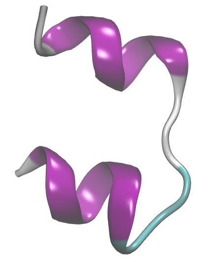

<h1 align="center">Dinâmica Molecular da Insulina Humana (PDB: 3I40) em água</h1>

<div align="center">
  <strong>🚀 Objetivo 📚</strong>
</div>

<div align="center">
  <p>Simular a insulina humana em uma caixa cúbica de água com temperatura de 298 K e 1 bar de pressão. A insulina é um hormônio regulador da entrada de glicose nas células humanas.</p>
  <p>Explore, colabore e divirta-se! 😄</p>
</div>

## 📖 Índice

- [Arquivos iniciais.](#arquivos-iniciais)
- [Preparo da topologia da molécula: campos de forças.](#preparo-da-topologia-da-molécula-campos-de-forças)
- [Configuração do Ambiente](#configuração-do-ambiente)
- [Como Contribuir](#como-contribuir)
- [Licença](#licença)

## Arquivos iniciais.

Inicialmente precisamos obter as coordenadas da nossa biomolécula, campos de forças e arquivos inputs para a dinâmica. Essa etapa faz parte do planejamento do projeto.

Vamos trabalhar com a biomolécula [Insulina](https://doi.org/10.1107/S1744309110000461) que possui o codigo [3I40](https://www.rcsb.org/structure/3I40) no PDB. O PDB é um banco com várias biomoléculas depositadas e identificadas por códigos. Explore mais informações do PDB e da biomolécula.



>[!TIP]
> Organize o diretório de trabalho criando as pastas `analysis` para os arquivos de analises e `inputs` para os arquivos .mdp da dinâmica molecular.
>

```
├── 3i40.pdb
├── amber14sb_parmbsc1_cufix.ff
│   ├── aminoacids.arn
│   ├── aminoacids.c.tdb
│   ├── aminoacids.hdb
│   ├── aminoacids.n.tdb
│   ├── aminoacids.r2b
│   ├── aminoacids.rtp
│   ├── aminoacids.vsd
│   ├── atomtypes.atp
│   ├── ca-sol7.itp
│   ├── ca-sol7.pdb
│   ├── cufix.itp
│   ├── dna.arn
│   ├── dna.hdb
│   ├── dna.r2b
│   ├── dna.rtp
│   ├── ffbonded.itp
│   ├── ffnonbonded.itp
│   ├── ffnonbonded.itp~
│   ├── forcefield.doc
│   ├── forcefield.itp
│   ├── forcefield.itp~
│   ├── gbsa.itp
│   ├── ions.itp
│   ├── Makefile.am
│   ├── Makefile.in
│   ├── mg-sol6.itp
│   ├── mg-sol6.pdb
│   ├── README.md
│   ├── rna.arn
│   ├── rna.hdb
│   ├── rna.r2b
│   ├── rna.rtp
│   ├── spce.itp
│   ├── spc.itp
│   ├── tip3p.itp
│   ├── tip4pew.itp
│   ├── tip4p.itp
│   ├── tip5p.itp
│   ├── urea.itp
│   └── watermodels.dat
├── analysis
└── inputs
    ├── ions.mdp
    ├── md.mdp
    ├── minim.mdp
    ├── npt.mdp
    └── nvt.mdp
```

## Preparo da topologia da molécula: campos de forças.

O arquivo `3i40.pdb` contém as coordenadas da biomolécula com moleculas de água e ligantes e será necessário remover as moléculas de água (`HOH`) e outros ligantes (`HETATM`) para evitar erros. Isso pode ser feito manualmente direto no arquivo ou pelo prompt de comando:

```
grep -v HETATM 3i40.pdb > 3i40_clean.pdb
```

Também é necessário observar que algumas biomoléculas possuem várias cadeias identificadas como `chain A`, `chain B` etc. Recomenda-se remover manualmente as cadeias que não serão estudadas e, nesse caso, removi a cadeia B com um editor simples de texto.

Agora, vamos escolher o campo de força e o modelo de água:

```
gmx pdb2gmx -v -f 3i40_clean.pdb -o insulina.gro

# -v = verbose, para visualizar o processo.
# -f = file input, arquivo de coordenadas de entrada.
# -o = file output, arquivo de coordenadas de saída.
```
Quando solicitado, digite o número correspondente para selecionar o campo de força e o modelo de água. Digite 1 para escolher AMBER e 1 para escolher o modelo de água TIP3P que é o recomendado para o campo de força AMBER.

O Gromacs assumirá valores canônicos para cada aminoácidos, levando em consideração valores de pH próximos da neutralidade. Entretanto, a carga líquida global é conservada e pode ser visualizada no display como `Total charge -2.000 e`.

Para visualizar no VMD, utilize:
```
vmd insulina.gro
```

>[!NOTE]
>Saiba mais sobre o comando [gmx2pdb](https://manual.gromacs.org/documentation/current/onlinehelp/gmx-pdb2gmx.html).
>Será gerado os seguintes arquivos:
> - insulina.gro = arquivo com as coordenadas de cada átomo da biomolécula compatível com o campo de força.
> - topol.top = arquivo com a topologia da biomolécula, ou seja, com os parâmetros necessários para o cálculo das forças.
> - posre.itp = arquivo de topologia auxiliar indicando os átomos com restrição por padrão.
>

Campo de Força  |  Informações  |  Modelo de água  |  cut-off
------- | -------- | -------- | -------- 
**OPLS**    | O campo de força OPLS-AA (Optimized Potentials for Liquid Simulations – All Atom) é amplamente usado para simulações de proteínas, pequenas moléculas, solventes, lipídios, dentre outros. | TIP4P recomendado, mas pode usar TIP3P. Não recomendado SPC. | 1.0~1.2 nm
**AMBER**   | A família de campos de força AMBER (como amber99sb, amber99sb-ildn, amber14, etc.) é amplamente usada para proteínas, DNA/RNA e simulações biomoleculares. | TIP3P, não recomendado TIP4P e SPC. | 1.0~1.2 nm
**CHARMM**  | O campo de força CHARMM (como charmm36-jul2022.ff) é extremamente detalhado, especialmente para lipídios, proteínas e açúcares, e foi parametrizado com switching functions, o que o diferencia das abordagens anteriores. | TIP3P modificado, não substituir por TIP3P comum. | 1.2 nm
**GROMOS**  | O campo de força GROMOS96 (como gromos54a7.ff) é uma escolha clássica para simulações de proteínas, sistemas aquosos e alguns tipos de estudos de bioenergia. Ele é o único desta lista a usar potencial truncado sem PME. | SPC | 1.4 nm

| Modelo | Tipo | Descrição |
|--------|------|--------------------------------|
| **SPC** | 3 pontos | Modelo rígido, ângulo fixo de 109.47°, parametrizado para propriedades macroscópicas. |
| **SPC/E** | 3 pontos | Versão estendida do SPC, com correção de energia de polarização. Melhor densidade e constante dielétrica. |
| **TIP3P** | 3 pontos | Muito usado com AMBER e CHARMM. Simples e compatível com muitos campos de força. |
| **TIP4P** | 4 pontos | Inclui ponto virtual (M-site) para carga negativa fora do oxigênio, melhorando propriedades de fase. |
| **TIP5P** | 5 pontos | Dois pontos extra para os pares de elétrons do oxigênio. Mais preciso para estrutura tetraédrica, porém mais custoso. |

>[!TIP]
>A escolha do campo de força e do modelo de água deve considerar a natureza do sistema e as propriedades que se deseja investigar.
>

---

## Definindo a caixa de simulação.

Forneça instruções claras e detalhadas sobre como configurar o ambiente de desenvolvimento localmente. Isso pode incluir:

- Pré-requisitos
- Instalação de dependências
- Configuração do banco de dados
- Configuração de variáveis de ambiente
- Execução de migrações ou scripts de inicialização
- ...

Certifique-se de fornecer exemplos de comandos ou scripts necessários para executar o projeto corretamente.

## Minimização do sistema

Se você deseja contribuir para o projeto, siga estas etapas:

1. Faça um fork do repositório e clone-o em sua máquina local.
2. Crie uma nova branch para suas modificações:
   ```
   git checkout -b minha-branch
   ```
3. Faça as modificações desejadas e adicione-as ao stage:
   ```
   git add .
   ```
4. Faça um commit das suas alterações:
   ```
   git commit -m "Minhas modificações"
   ```
5. Envie suas alterações para o repositório remoto:
   ```
   git push origin minha-branch
   ```
6. Abra um pull request para que suas modificações sejam revisadas e incorporadas ao projeto.

## Equilíbrio NVT e NPT: termostatos e barostatos.

Se você deseja contribuir para o projeto, siga estas etapas:

## Produção: integradores.

Se você deseja contribuir para o projeto, siga estas etapas:

---

## 📄 Licença

Este projeto está licenciado sob a [Nome da Licença]. Consulte o arquivo [LICENSE](LICENSE) para obter mais informações sobre os termos de licenciamento.
